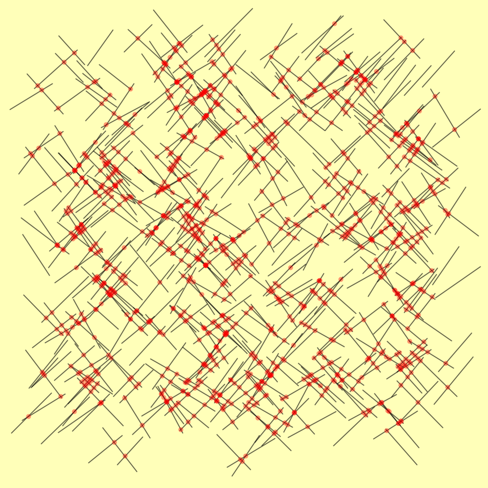
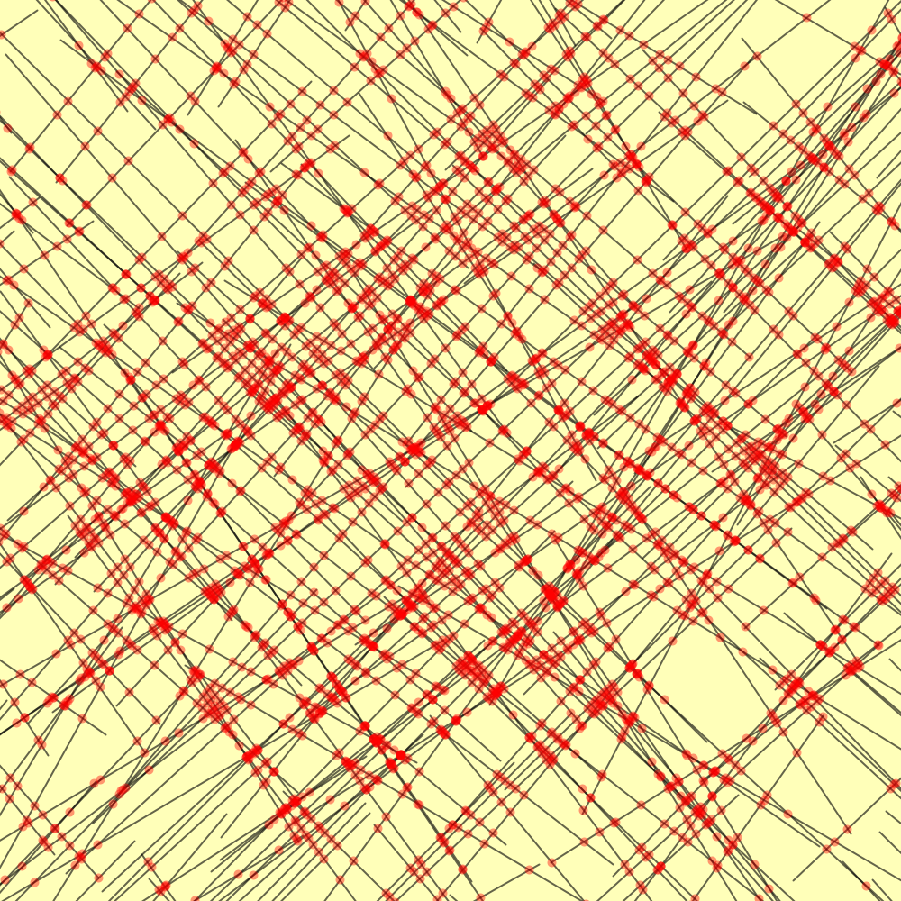

[](https://jitpack.io/#micycle1/balaban-intersection)


# Balaban Line Segments Intersection

<p float="middle">
  
  
</p>

## Overview
Reporting of segment set intersections is one of the
fundamental problems of computational geometry. This library implements *Ivan J. Balaban*'s [*Intermediate Algorithm*](https://www2.cs.sfu.ca/~binay/813.2011/Balaban.pdf) for finding intersecting segment pairs from a given set of N segments in the plane.

This algorithm has complexity *O( n\*log<sup>2</sup>(n) + k )* (where k is the number of intersecting pairs), which is **much** faster than the more commonly implemented *O( (n+k)\*log(n) )* *Bentley–Ottmann* algorithm for the same problem. In practice therefore, this library processes sizeable segment sets orders of magnitude more quickly than existing (Java) *Bentley–Ottmann* implementations.

This repository improves the abandoned original project from *Google Code Archive* whose author was [Taras](https://github.com/taarraas), and is provided as an artifact via [Jitpack](https://jitpack.io/#micycle1/balaban-intersection) for easy use in Maven/Gradle projects.

## Input

The algorithm processes a single collection of line segments.


The algorithm itself does not check for or handle *degenerate* inputs and will error (generally a stack overflow) on such inputs. The library offers the `findDegenerateSegments()` method to identify degenerate segments before processing.

Segment sets are degenerate when:
- Contains a vertical segment (whose vertices have the same X coordinate)
- Contains segments where a vertex from each share an x coordinate.

## Usage

The algorithm does not natively compute **points** of intersection. Rather, it returns intersecting **segment pairs**.

You must provide a callback function to the solver: *it* provides intersecting pairs — *you* decide what to do with them.

### Code Example
```
Random r = new Random(0);

Collection<Segment> segments = new ArrayList<>();
for (int i = 0; i < 2000; i++) {
	segments.add(new Segment(r.nextDouble(), r.nextDouble(), r.nextDouble(), r.nextDouble()));
}

Collection<Point> points = new ArrayList<>();

BalabanSolver balabanSolver = new BalabanSolver((a, b) -> {
    	// will be called by the solver for each intersecting pair
	points.add(a.getIntersection(b));
});

balabanSolver.computeIntersections(segments);
```
